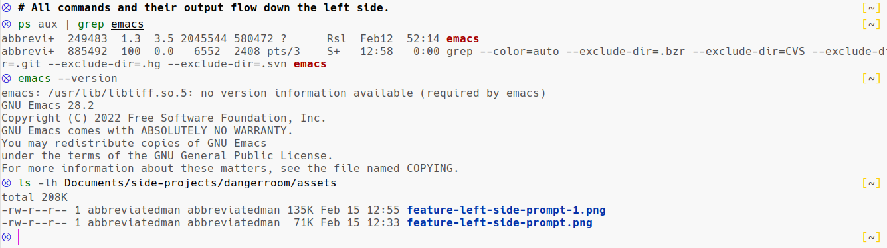
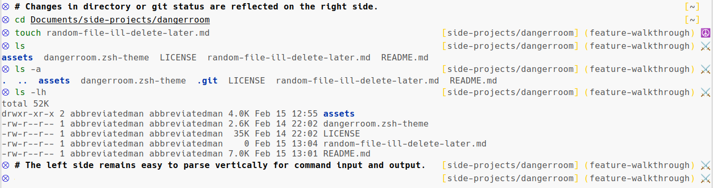

# dangerroom

dangerroom is an [oh-my-zsh][oh-my-zsh] theme that's informative, minimal, and, above all, X-Men themed. It's designed to focus the eye on the terminal's line-by-line command/response cycle, which is helpful for all users but particularly so for early-career programmers still getting a sense for the command line.

Like [the original Danger Room in the X-Men universe](https://en.wikipedia.org/wiki/Danger_Room), the dangerroom theme helps you train and improve your skills.

### Design Principles

The information in the terminal can be broken up into 3 main categories:

1. **The command/response cycle**, wherein the user enters a command and the system responds.
2. **Extra information the user needs occasionally**, such as working directory information or the basic version control state.
3. **_Extra_ extra information**, such as the time, the weather, the current logged-in user, the full path to the working directory, or a deeper dive into version control state.

The most important design decision a terminal layout designer can make is **how prevalent and visible those 3 categories of data should be for the user**.

According to our prioritization, users should always be able to:

1. **easily see the command/response cycle history**, keeping it right at their eyeline and simply parseable.
2. **check extra info they occasionally need** by simply glancing away from their main eyeline.
3. **get rarely-needed additional information by entering commands _only_**, _not_ by adding further noise to the signal/noise ratio by including this usually-extraneous info within sight in a terminal theme.

The below feature list is how we have gone about implementing this design philosophy.

### Features

We implement the design philosophy above using:

- **A minimal left-side prompt**, making it easy for the user to look straight up and parse command and output history.
- **The most useful information and nothing else**, so the user can get the vital info they need at a glance, saving extra info for deeper dive commands.
- **A no-extra-space-needed Vim Mode indicator**, to give Vim-on-the-command-line users at-a-glance visual feedback on their current mode without impacting our minimalist setup.

Here's more on each.

#### Minimal Left-Side Prompt

Someone used to the command line can do a reasonable job skimming over the unimportant information to quickly eye the input/output info in a terminal. But it's easier, for new command-line users and experts alike, to keep the following separate:

- **Commands the user entered and the system's feedback on those commands**. This is the command line's main job and should be stable on the screen and easily parsed.
- **Extra state info a user often wants**, such as version control status or working directory info. This is good info to have, but should be moved away from the user's main eyeline.

This is why the left side of the dangerroom theme is for **commands and their output _only_**.

Furthermore, vertical information is far easier for the human mind to parse quickly than having to scan both horizontally and vertically.

This is why dangerroom's left-hand prompt is a small symbol that stays affixed to the left-hand side no matter what else changes (e.g., the current working directory's character length). This keeps it stable in the eyeline—see any theme with the working directory on the left side for an example of how disruptive to effortless history parsing it can be to have commands in different vertical columns.

The result is a terminal experience that prioritizes the command/response cycle by moving all other visual clutter to the side.



#### Vital Info Only

When the user _does_ want more information than the input/output from their commands, they can look to the right, where they can see directory and version control information.

Extra info is always easily obtainable through explicit commands, such as the current time (using `date`, for example), or the full path to the working directory (with `pwd`). Since this information is easily obtainable and rarely used, having it in the user's view would provide visual "noise", making the relevant information harder to find, no matter how used to skimming it the user becomes. At the same time, a bare-minimal theme often fails to provide enough information, making a command-line user have to ask for further information. This theme strikes a balance between the bare minimum some themes provide and the overwhelming data/noise that many others foist upon their users.

- Rather than _just_ displaying the current directory, which is often insufficient given how many similarly-named directories a user often has, or the full path, which is easily obtained but usually unnecessary, this theme provides the current directory _and_ the parent directory.
- Similarly, for Git repos, this theme prints out the current branch and the working tree status ("clean" or "dirty"), obviating the need for most `git status` checks, without drowning the user in the many columns of data a deeper status report on their repository would need.



#### Vim Mode Indicator

For those few who use Vim keybindings on the command line, the left-hand symbol changes color when in Normal Mode to help the user track their current Mode. This is useful visual feedback for some users, but it takes up no further space (keeping the history easily parsed), and it doesn't complicate the situation for those who use the default keybindings of their shell and terminal emulator.


### Installation

#### Prerequisites

- [ZSH](https://en.wikipedia.org/wiki/Z_shell) (the Z Shell), the default shell on modern macOS systems.
- [Oh My Zsh][oh-my-zsh]. Besides countless other useful features, OMZ makes managing themes a breeze—few manage ZSH themes without it, in fact.

#### How To Install

- Be sure you have the prerequisites above.
- Clone or download this repository.
- Take the `dangerroom.zsh-theme` file from this repo and put it in your `~/.oh-my-zsh/themes` directory.
- Edit the `.zshrc` file that's in your home directory, setting the `ZSH_THEME` variable to the value `"dangerroom"`, like so:

```sh
ZSH_THEME="dangerroom"
```

A similar line should already be in the file—you can change it to look like the above line, instead.

- To activate the theme: either open a new terminal window or tab, which will reload your settings and activate the theme, or activate the theme in your current terminal by running this command, which reads in your zsh configuration:

```sh
source ~/.zshrc
```

- Get to work in the Danger Room, practicing and sharpening your command-line skills.

### Additional Setup Recommendations

#### Fonts and Terminals

Please note that _some_ terminal/font combinations display this theme's symbols either cut off, or at half their normal size, or with simpler emojis than in the examples shown above. Consider experimenting with combining different fighting techniques (terminals and fonts) if you want to hone your powers and survive in a superpowered world (have good-looking emojis).

#### Better Vim Keybindings Experience

If you like using Vim bindings on the command line, I recommend adding [this fantastic zsh plugin](https://github.com/softmoth/zsh-vim-mode). It has many useful Vim-on-the-command-line enhancements, such as vim-surround keybindings and a customizable shortcut for switching to Normal Mode.

Using a non-escape shortcut is useful for those who don't like to or can't easily reach or remap the escape key, or for those who use the escape key for something else, as this author does when using Evil Mode in Emacs.

### Current Issues

These are fixable issues—please respond to the Issues on the GitHub repo if you'd like to discuss working on them.

#### Requires Oh My Zsh

The most likely user not currently supported by this theme is one who has ZSH (the default on Mac) but has not installed Oh My Zsh (which takes a couple extra steps). It should be doable to remove Oh My Zsh code, or replace it with pure Zsh code.

Contributions are welcome.

#### Does Not Support Other VCSs

It would be nice to support other Version Control Systems, like SVN and Mercurial. For those who are using another VCS, it would take the place of the Git info, so would still adhere to our minimalist philosophy and feature set.

I don't currently have sufficient experience with other VCSs to judge what info users would want under those systems, but contributions from those with more experience with those tools would be quite welcome.

#### Requires Zsh

This theme could relatively easily be ported to other shells, such as BASH, Fish, or Eshell. The target user of this theme generally hasn't switched shells, so this isn't a high priority, but contributions are still welcome.


### Prior Art

- I was helped along greatly by the very helpful code comments in the excellent [wedisagree theme](https://github.com/ohmyzsh/ohmyzsh/blob/master/themes/wedisagree.zsh-theme), one of oh-my-zsh's built-in themes. 
- [This blog post by Paweł Gościcki](http://pawelgoscicki.com/archives/2012/09/vi-mode-indicator-in-zsh-prompt/) assisted with some of the finer points of Vim prompt colorization, as did the user comments for it.

### Contributing

This project is licensed under the GPL v3. If you'd like to contribute, with ideas or code, please open a GitHub Issue, or check out the open Issues.

[oh-my-zsh]: https://ohmyz.sh/
