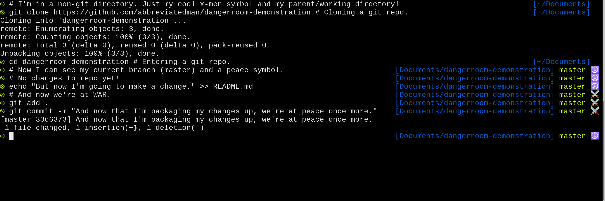

# dangerroom

The Danger Room in X-Men:


The dangerroom theme in your terminal:



Dangerroom is a [zsh][zsh] theme that's informative, minimal, and, above all, X-Men themed.

## Feature Walkthrough

- looks good in most light or dark themes
- minimal left prompt for easy history parsing
- working-directory-and-parent-directory
- minimal git info
- vim mode indicator

## Installation

### Prerequisites

This theme only supports the Zsh shell. If you make a version that supports other shells, please let me know, so I can link it here!

### Installing Using Oh My Zsh (Recommended):

- Install [oh-my-zsh][oh-my-zsh], if you don't have it already. Their site has excellent directions for how to do so, and you'll never look back.
- Clone or download this repository.
- Take the `dangerroom.zsh-theme` file from this repo and put it in your `~/.oh-my-zsh/themes` directory.
- Edit the `.zshrc` file in your home directory to set the `ZSH_THEME` variable to the value `"dangerroom"`, like so:

```sh
ZSH_THEME="dangerroom"
```

- To activate the theme, either open a new terminal window, or get it in your current terminal by running this command to read in your zsh configuration.

```sh
source ~/.zshrc
```

- Let the Danger Room sharpen your command line skills.

### Installing Without Oh My Zsh

If you don't have or want Oh My Zsh, then you probably already know how to install themes. Feel free to submit a PR with other sets of directions, though.

## Additional Setup Recommendations

### Fonts and Terminals

Please note that _some_ terminal/font combinations display this theme's symbols either cut off or at half their normal size. Consider experimenting with combining different fighting techniques if you want to hone your powers and survive in a superpowered world. And if you want good-looking emojis.

### Better Vim Keybindings Experience

I recommend adding [this fantastic zsh plugin](https://github.com/softmoth/zsh-vim-mode) if you like using Vim bindings on the command line. It's a little bit better than the built-in plugin, and minor improvements are _always_ worth spending a bunch of time configuring, am I right? (I do hope I'm right.)

## Prior Art

- I was helped along greatly by the very helpful comments in the excellent wedisagree theme, part of oh-my-zsh's built-in themes. https://github.com/ohmyzsh/ohmyzsh/blob/master/themes/wedisagree.zsh-theme
- This blog post by Paweł Gościcki assisted with some of the finer points of Vim prompt colorization, along with the comments it inspired: http://pawelgoscicki.com/archives/2012/09/vi-mode-indicator-in-zsh-prompt/
